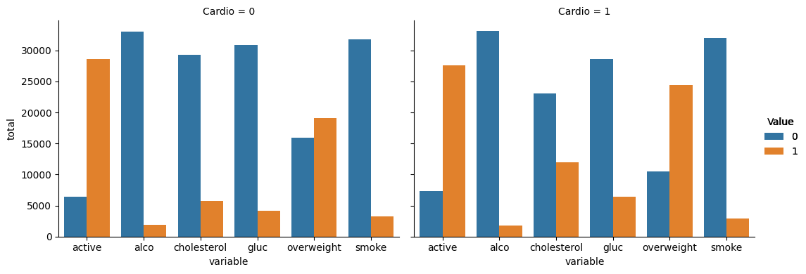
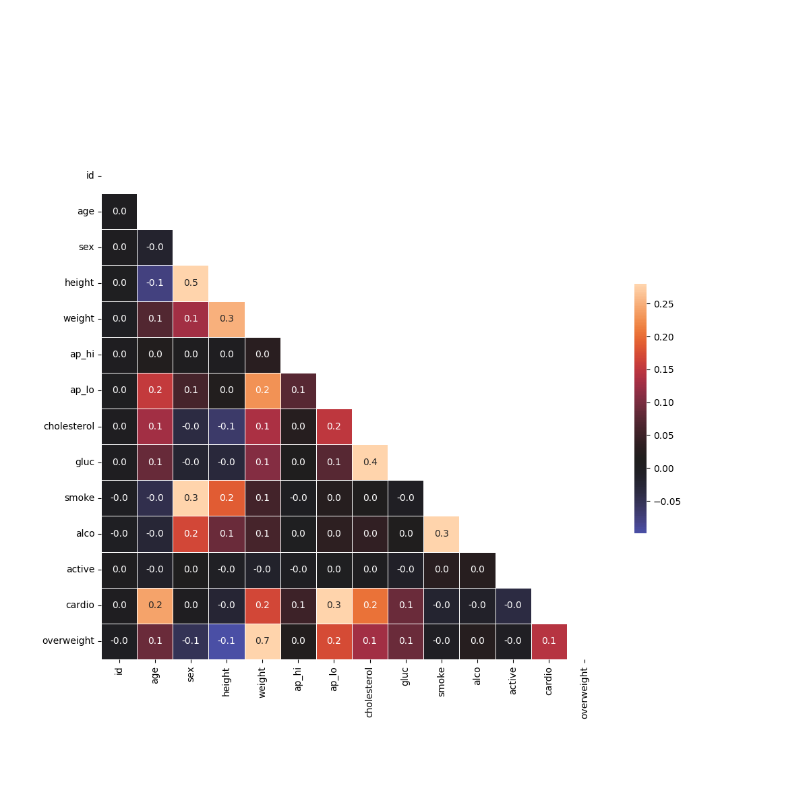

# Medical Data Visualizer

## Project Description

This **python** project is a solution to this [FreeCodeCamp project](https://www.freecodecamp.org/learn/data-analysis-with-python/data-analysis-with-python-projects/medical-data-visualizer) to analyze and visualize medical examination data. 

The primary goal of this project is to explore how different medical and lifestyle factors contribute to heart disease. It provides valuable insights into the prevalence of heart disease and its correlation with lifestyle choices like smoking, alcohol consumption, and physical activity.


### Key Features

- **Data Cleaning and Transformation**: Includes steps for cleaning the data, such as removing outliers and normalizing certain variables (e.g., cholesterol and glucose levels), as well as calculating new metrics like BMI to determine if an individual is overweight.
- **Categorical Data Visualization**: Displays counts of different health factors such as cholesterol levels, glucose levels, smoking habits, alcohol consumption, and physical activity, categorized by individuals with and without cardiac disease.
- **Correlation Heatmap**: Generates a heatmap to show the correlations between various medical factors (e.g., blood pressure, cholesterol, weight) and their potential relationships with heart disease.


## Technologies Used

This project uses a combination of the following Python libraries to manipulate, analyze, and visualize the dataset:

- **Pandas**: python library used for data manipulation, cleaning, and transformation. It allows easy loading and processing of the dataset in CSV format and helps prepare the data for analysis and visualization.
  
- **Matplotlib**: A powerful plotting python library used to create visualizations. 

- **Seaborn**: A statistical data visualization library built on top of **Matplotlib**. It is used to generate informative and attractive data visualizations, such as the heatmap and the categorical plot used in this project.


## Project Structure

- `medical_data_visualizer.py`: The main Python file where the data analysis and visualization functions are implemented.
- `medical_examination.csv`: The CSV file containing medical examination data used for analysis.
- `main.py`: A script for running the unit tests, analysis and visualizations.
- `test_module.py`: Unit tests to validate the functionality of the code.
- `README.md`: Project documentation (this file).
- `requirements.txt`: A list of required dependencies for this project.

---
## Steps of this project:

### 1. Importing Data

- Importing the dataset from `medical_examination.csv` and loading it into a Pandas DataFrame.

### 2. Adding an Overweight Column

- Adding an **overweight** column based on BMI. The BMI is calculated by dividing the weight (in kg) by the square of the height (in meters).
  - If BMI > 25, the individual is considered overweight (value = 1).
  - Otherwise, they are not overweight (value = 0).

### 3. Normalizing the Data

- Normalizing the data for the **cholesterol** and **gluc** columns:
  to make (0 : good) and (1 : bad).

### 4. Drawing the Categorical Plot

- Creating a function `draw_cat_plot()` that visualizes categorical data (e.g., cholesterol, gluc, smoking habits, alcohol consumption, physical activity, and overweight status) by **cardio** (whether or not the individual has heart disease).
- Used **Seaborn's `catplot()`** to generate the categorical plot and showed the count of each feature for the different categories of **cardio** (1 = has heart disease, 0 = does not have heart disease).
  
### 5. Drawing the Heatmap

- Created a function `draw_heat_map()` that visualizes the correlation matrix between different medical features in the dataset:
  - **Data Cleaning**: by Filtering out incorrect data (e.g., patients with diastolic pressure higher than systolic pressure, outliers in height and weight).
  - **Correlation Matrix**: Calculated the correlation matrix of the cleaned data.
  - **Heatmap**: Ploting the correlation matrix using **Seaborn's `heatmap()`**, with a mask for the upper triangle to avoid redundancy.

---
## Sample Visualizations
These are the visualizations created by this project, illustrating insights from the data:

1. **Categorical Plot** : A plot that shows the count of different health outcomes (e.g., cholesterol, smoking habits) by cardio status (whether or not the patient has heart disease).


2. **Heatmap**: A visualization of the correlation between different variables, such as height, weight, blood pressure, and cholesterol.



## Requirements

Before running the project, you will need to install the following dependencies included in `requirements.txt`:

- **Pandas**: For data manipulation and cleaning.
- **Matplotlib**: For creating visualizations.
- **Seaborn**: For advanced statistical visualizations.


Run `main.py` which will run the unit tests and generate the visualizations.
```bash
python main.py
```
